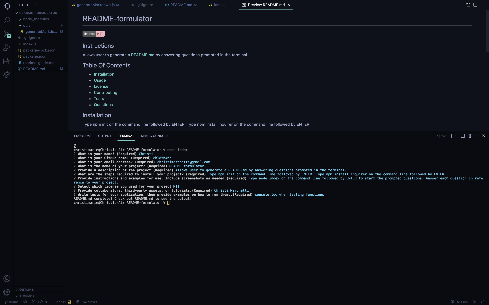

# Project Hoard

## Description 
Project Hoard is an application containg a little about myself,my top projects, contact information, and resume.

## Table of Contents
* [Installation](#installation)
* [Usage](#usage)
* [License](#license)
* [Contributing](#contributing)
* [Tests](#tests)
* [Questions](#questions)

## Installation 
The user should clone the repository from GitHub. Once updates are made you can commit any changes and deploy to github.

## Usage 
The navbar will navigate the user to different sections of the page titled About Me, Contact, Portfolio, and Resume. When on the Portfolio section the user can scroll through each project using the left and right arrows on each side. The user can also navigate to each project page by clicking on the project picture and can access the GitHub by clicking the link below the photo. Users can dowload a copy of my resume by clicking the resume link at the bottom of the page under my headshot photo. For any questions regarding any of my projects or further information the user can click on my email link above my head shot photo.

LIVE URL: https://chl850405.github.io/Project-Hoard/

GitHub URL: https://github.com/chl850405/Project-Hoard.git 

https://chl850405.github.io/Grow-Your-Business/

#Grow-Your-Business

https://chl850405.github.io/top-score

#top-score

https://chl850405.github.io/Password-Generator/

https://chl850405.github.io/work-day-scheduler/

https://www.youtube.com/watch?v=dIQ4UGHoxXc

https://github.com/chl850405/Employee-tracker

https://agile-tor-28300.herokuapp.com

## License 
This project is not licensed

## Contributing 
Contributors should read the installation section. 

## Tests
There are no tests for this application. 

## Questions
If you have any questions about this projects, please contact me directly at christimarchetti@gmail.com. You can view more of my projects at https://github.com/chl850405.

